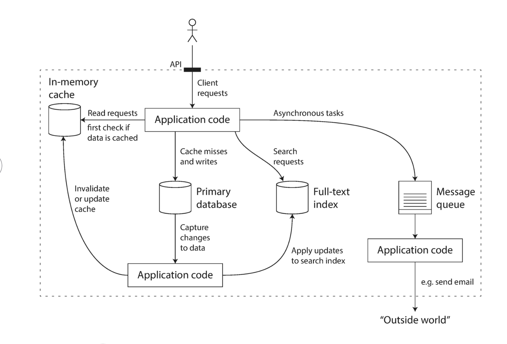

# Reliable, Scalable, and Maintainable Applications
Applications today are more *data-intensive* relative to being *compute-intensive*

In this chapter, we will start by exploring the fundamentals of what we are trying to achieve: reliable, scalable, and maintainable data systems. These definitions will be elaborated on later in this chapter.

## Thinking About Data Systems
We typically think of databases, queues, and caches as being very different categories of tools

Though a database and a message queue have some similarities, both store data for some time, they have very different access patterns

**So why do we lump everything under an umbrella term like data systems?**

1. Many new tools for data storage and processing have emerged in recent years, and they no longer neatly fit into traditional categories of data storage
    - Data stores that are also used as message queues (Redis)
    - Message queues with database-like durability (Apache Kafka)

The boundaries between categories are becoming blurred.

2. Increasingly many applications now have such demanding or wide-ranging requirements that a single tool can no longer meet all of its data processing and storage needs, instead the work is broken down into tasks that can be performed efficiently on a single tool, and those different tools are stitched using application code

Figure 1-1: One possible architecture for a data system that combines several components

Okay! So this is quite the image to drop out of nowhere, so I will try to break things down. This is a simple architecture on how data flows when handling read, write, and search requests and asynchronous microservices.

The client requests come through an API and now, the juicy stuff! There are four different possible starts here, I will go through them 1 by 1.

1. Handling a read-request
    - First, we check if the data is cached/inside of the cache (Redis, Memcached, Apache Ignite)
    - If the data is no cached (the cache "misses"), we check the primary database
    - We then update (not invalidate!) the cache with the data found in the primary database
    - Return the data

2. Handling a write-request
    - We directly query the primary database (Postgresql, Mysql, Snowflake)
    - Then we invalidate (not update!) the cache
        - Now if we are using lazy loading, the cache will be repopulated on its next read
        - If we are using Write-Through/Write-Back, the cache is immediately repopulated with the new data

3. Handling search request
    - The query forwarded to the full-text index (Elastisearch, Apache Solr)
    - First, the query is split into individual tokens and stopwords are removed
    - The full-text search engine looks up the tokens in its inverted index and "fuzzy matches" against the data
    - Results the data

4. Handling Asynchronous Tasks
    - Task is added as a "message" to the message queue (RabbitMQ, Apache Kafka, Amazon SQS)
    - The message queue stores the message until a consumer/worker process (Celery, Buill, Amazon Lambda, Apache Airflow Workers) is ready to process it
    - A worker service retrieves the message from the queue and the task is executed
    - Once the task is executed, the worker sends an acknowledgement to the queue and the message is removed
    - If the worker fails to process the message, the queue can
        - Retry the task after a delay
        - Move the message to a dead letter queue for later inspection

When you combine several tools in order to provide a service, the service's interface or application programming interface (API) usually hides those implementation details from clients

## Questions that Data Systems Engineers Asks
This brings you from the world of application development to data system designing.

With this arises many questions:
- How can we ensure the data remains correct and complete, even when things go wrong internally?
- How can we provide consistent and high performance to clients, even when parts of the system are degraded?
- How do you scale to handle an increase load?
- What does a good API for the service look like?

## The Three Most Important Concerns in Software Systems
There are many factors that may influence the design of a system, such as:
- The skills of the people involved
- Legacy system dependencies
- Timescale for delivery
- Risk tolerance
- Regulatory constraints

We will focus on the three most important concerns in software systems:
1. **Reliability**
The system should continue to work correctly even in the face of *adversity* (software faults, human error)

2. **Scalibility**
As the system grows (in data volume, traffic volume, and complexity), there should be a reasonable way of dealing with that growth

3. **Maintainability**
Over time, many different people will work on the system, they should all be able to work on it productively

### Reliability
Everybody has an intuitive idea of what it means for something to be reliable or unreliable. For software, typical expectations include:
- The application performs the function that the user expected
- It can tolerate the user making mistakes or using the software in unexpected ways
- Its performance is good enough for the required use case, under the expected load and data volume
- The system prevents any unauthorized access and abuse

Things that can go wrong are *faults*, and systems that anticipate faults can cope with them, are are called *fault-tolerant* or *resilient*

Note that a fault is different from a failure. A fault is usually defined as one component of the system deviating from its spec, whearas a *failure* is when the system as a whole stops providing the required service to the user

It is impossible to reduce the probability of a fault to zero, therefore it is usually best to design fault-tolerance mechanisms that prevent faults from causing failures

Counterintuitively, in such fault-tolerance systems, it can make sense to increase the rate of faults by triggering them deliberately, like killing random processes without warning, this can ensure that the fault-tolerance machinery is continually exercised and tested

Though we generally prefer fault tolerance over fault preventation, there are cases where prevention is better than the cure, because no cure exists, such as if an attacker has comprimised te system, however we will mostly talk about faults that can be cured.

