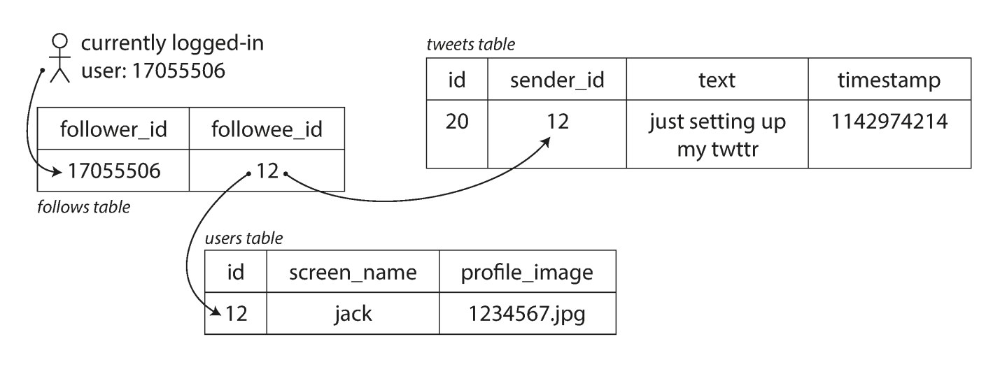
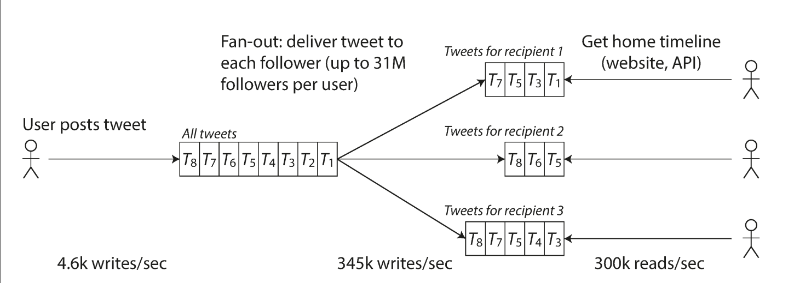

# Scability
Even if a system is working reliable today, that doesn't mean it will work reliably in the future

One common reason for degradation is increased load: perhaps the system has grown from 10,000 concurrent users to 100,000 concurrent users, or from 1 million to 10 million

Perhaps it is processing much larger volumes of data then it did before

*Scalability* is the term we use to describe a system's ability to cope with increased load

Note, however that it is not a one-dimensional label that we can attach to a system

It is meaningless to say "X is scalable" or "Y doesn't scale", rather discussing scalability means consideration questions like "if the system grows in a particular way, what are options for coping with growth?" and "How can we add computing resources to handle the load"

## Describing Load
First, we need to succintly describe the current load on the system

Load can be described with a few numbers which we call *load parameters*

The best choice of parameters depends on the architecture of your system, it may be:
- Requests per second to a web server
- The ratio of reads to writes in a database
- The number of simulataneously active users in the chat room
- The hit rate on a cache

Perhaps the average case is what matters, or the bottleneck is dominated by a small number of extreme cases

## Twitter Case Study
To make this idea more concrete, let's use Twitter as an example, using data published in November 2012, two of Twitter's main operations are:
**Post Tweet**
A user can publish a new message to their followers (4.6k requests/sec on average, over 12k requests/sec at peak)

**Homeline Timeline**
A user can view tweets posted by the people they follow (300k requests/sec)

Simplify handle 12,000 writes per second would be fairly easy, however Twitter's scaling challenge is not primarily due to tweet volume, but due to fan-out, each user follows many people, and each user is followed by many people, there are broadly two ways of implementing these two operations:

1. Posting a tweet simply inserts the new tweet into a global collection of tweet. When a user requests their homeline timeline, look up all the people they follow, find all the tweets for each of those users, and merge them (sorted by time), in a relational database, it could be queried as such:

```sql
SELECT tweets.*, users.* FROM tweets
    JOIN users ON tweets.sender_d = users.id
    JOIN follows ON follos.followee_id  = users.id
    WHERE follows.follwer_id = current_user
```

This method is known as **fan-out read**!


*This figure depicts a simple relational schema for implementing a Twitter home timeline*

2. Maintain a cache for each user's home timeline, like a mailbox of tweets for each recipient user

When a user posts a tweet, look up all the people who follow that user, and insert hte new tweet into each of their home timeline caches

The request to read the home timeline is then cheap, because its result has been computed ahead of time


*This figure, is Twitter's data pipeline for delivering tweets to followers, with load parameters as of November 2012*

It represents **method 2, fan-out write**, let's delve a bit deeper into it!

1. User Posts Tweet
    - A user generates a tweet that get's stored in the "All Tweets" database
    - This write rate is shown as 4.6k writes/sec which means 4,600 tweets are created every second globally
2. Fan-out process
    - The tweet is distributed to the timelines of user's followers, this is called a **fan-out**
    - If a user has many followers the system must create multiple copies of the tweet to be added to the timelines of these followers
    - This results in a high volume of write operations (to their home timeline caches)
3. Home Timeline Retrieval
    - When a user logs in or accesses their home timeline, the system retrieves tweets from the timeline storage specific to the user

### Analyzing the Two Methods
The first version of Twitter used approach 1, but the systems struggled to keep up with the load of home timeline queries, so the company switched to approach 2

This works better as the average rate of published tweets is almost two orders of magnitude lower than the rate of home timeline reads, and so in this case it's preferable to do more work at write time and less at read time

However, the downside of approach 2 is that posting a new tweet now requires a lot of extra work. On average, a tweet is delivered to about 75 followers, so 4.6k twwets per second becomes 345k writes per second to the home timeline caches, but this average hides the fact that the number of followers per user varies widely, some users have over 30 million followers, this means that a single tweet may result in over 30 million writes to home timelines!

Twitter tries to deliver tweets to followers within 5 seconds, which is a significant challenge

In the example of Twitter, the distribution of followers per user is a key load parameter for discussing scalibility, since it determines the fan-out load

Finally, Twitter is moving to a hybrid of these two approaches where a small number of users with a large number of followers are exempt from this fan-out, these tweets are fetched separately and merged with that user's home timeline when it is read

This means that for celebrities, their tweets are stored separately in a central repository, when one of their followers reads their home timelines, the system dynamically fetches the celebrity's tweet from the "All Tweets" Database, this is merged with pre-distributed tweets from other sources