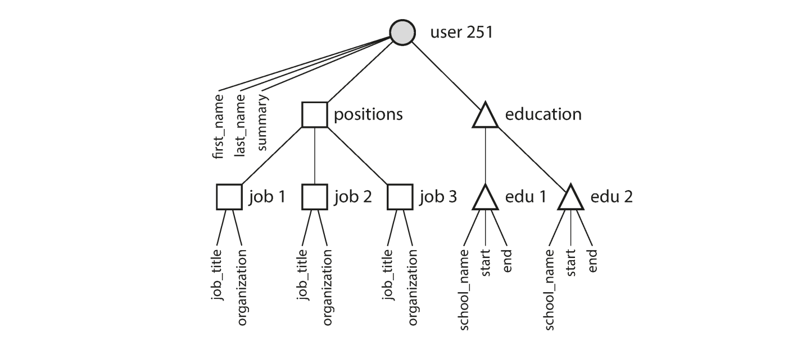

# Data Models and Query Languages
Data models are perhaps the most important part of developing software, because they have such a profound effect: not only on how the software is written, but also on how we *think about the problem* we are solving.

Most applications are built by layering one data model on top of another. For each layer, the key question is: how is it *represented* in terms of the next-lowest layer? For example:
1. As an application developer, you look at the real world and model it in terms of objects, data structures, and APIs that manipulate those data structures, those structures are often specific to your application
2. When you want to store those data structures, you express them in terms of a general-purpose data model, such as JSON or XML documents, tables in a relational database or graph model
3. The engineers who built your database software decided on a way of presenting that JSON/XML/relational/graph data in terms of bytes in memory, on disk, or on a network. The representation may allow the data to be queried, searched, manipulated, and processed in various ways
4. On yet lower levels, hardware engineers have figured out how to represent bytes in terms of electrical currents, pulses of light, magnetic fields, and more

In a complex application there may be more intermediary levels, such as APIs built upon APIs, but the basic idea is still the same: each layer hides the complexity of the layers below it by providing a clean data model, these abstractions allow different groups of people to work together effectively

There are different kinds of data models, and every data model embodies assumptions about how it is going to be used, some kinds of usage are easy and some are not supported

Some operations are fast and some perform badly; some data transformations feel natural and some are awkward, it can take a lot of effort to master just one data model

Building software is hard enough, even when working with just one data model and without worrying about its inner workings, but since the data model has such a profound effect on what the software above it can and can't do, it's important to choose one that is appropriate to the application

We will look at a range of general-purpose data models for data storage and querying, in particular we will compare the relational data model, the document model, and a few graph based data models, in the next chapter we will discuss how storage engines work; that is, how these data models are actually implemented

**Note**: Document databases are a type of NoSQL database, they store data in document formats like (JSON or BSON) which allows them to handle hierarchical data structures without requiring table-based structure and joins common in relational databases

## Relational Model Versus Document Model
The best-known data model today is probably that of SQL, based on the relational model proposed by Edgar Codd in 1970: data is organized into *relations* (called *tables* in SQL) where each relation is an unordered collection of *tuples* (*rows* in SQL)

The relational model was a theoretical proposal, and many people at the time doubted whether it could be implemented efficiently

However, by the mid-1980s, relational database management systems (RDBMSes) and SQL had become the tools of choice for most people who needed to store and query data with some kind of regular structure

The roots of relational databases lie in *business data processing*, which was performed on mainframe computers in the 1960s and '70s, the use cases appear mundane from today's perspective: typically *transaction processing* and *batch processing* (customer invoicing, payroll, reporting)

Other databases at that time forced application developers to think a lot about the internal representation of the data in the database, the goal of the relational model was to hide that implementation behind a cleaner interface

Over the years, there have been many competing approaches to data storage and querying, in the 1970s and early 1980s, the *network model* and the *hierarchical model* were the main alternatives but the relational model came to dominate them

Object databases came and went in the late 1980s and early 1990s, XML databases appeared in the early 2000s, but have only seen niche adoption, each competitor to the relational model generated a lot of hype in its time, but it never lasted

As computers became vastly more powerful and networked, they started being used for increasingly diverse purposes

And remarkably, relational databases turned out to generalize very well, beyond their original scope of business data processing, much it be online publishing, discussion, and social networking, e-commerce, games, and SAAS applications

## The Birth of NoSQL
Now, in the 2010s, NoSQL is the latest attempt to overthrow the relational model's dominance, the name "NoSQL" was originally a catchy Twitter hashtag, and has been retroactively reinterpreted as *Not Only SQL*

There are several driving forces behind the adoption of NoSQL databases, including:
- A need for greater scalability than relational databases can easily achieve, including very large databases or very high write throughput
- A widespread preference for free and open source software over commercial database products
- Specialized query operations that are not well supported by the relational model
- Frustration with the restrictiveness of relational schemas, and a desire for a more dynamic and expressive data model

Different applications have different requirements, and the best choice of technology for one use case may well be different from the best choice for another use case

It therefore seems like that in the foreseeable future, relational databases will continue to be used alongside a broad variety of nonrelational datastores, an idea that is sometimes called *polygot persistence*

## The Object-Relational Mismatch
Most application development today is done in OOP languages, which leads to a common criticism of the SQL model, if the data is stored in relational tables, an awkward translation layer is required between the objects in the application code and the database model, this disconnect between the models is sometimes called *impedance mismatch*

Object-relational mapping (ORM) frameworks like ActiveRecord and Hibernate reduce the amount of boilerplate code required for this translation layer, but they can't completely hid the differences between the two models

For example, we will try to illustrate how a resume could be expressed in a relational schema. The first profile as a whole can be identified by a unique identifier, `user_id`. Fields like `first_name` and `last_name` appear exactly once per user, so they can be modeled as columns on the `users` table

However, most people have had more than one job in their career, and people may have varying number of pieces of contact information

There is a one-to-many relationship from the users to these items, which can be represented various ways:
- In the traditional SQL model, the most common normalized representation is to put positions, education, and contact information in separate tables, with a foreign key reference to the `users` table
- Later versions of the SQL standard added support for structured data types and XML data, this allowed multi-valued data to be stored within a single row, with support for querying and indexing inside those documents, these features are supported to varying degrees by Oracle, IBM, DB2, MS SQL Server, and PostgreSQL. A JSON datatype is also supported by several databases including IBM DB2, MySQL, and PostgreSQL
- A third option is to encode jobs, education, and contact info as a JSON or XML document, store it on a text 

For a data structure like a resume, which is mostly a self-contained `document`, a JSON representation can be quite appropriate , JSON has the appeal of being much simpler than XML, JSON has the appeal of being much simpler than XML, document-oriented databases like MongoDB, RethinkDB, CouchDB, and Espresso support this data model

```json
{
    "user_id": 251,
    "first_name": "Bill",
    "last_name": "Gates",
    "summary": "Co-chair of the Bill & Melinda  Gates... Active blogger.",
    "region_id": "us:91",
    "industry_id": 131,
    "photo_url": "/p/7/000/253/05b/308dd6e.jpg",
    "positions": [
        {"job_title": "Co-chair", "organization": "Bill & Melinda Gates Foundation"},
        {"job_title": "Co-founder, Chairman", "organization": "Microsoft"}
    ],
    "education": [
        {"school_name": "Harvard University", "start": 1973, "end": 1975},
        {"school_name": "Lakeside School, Seattle", "start": null, "end": null}
    ],
    "contact_info": {
        "blog": "http://thegatesnotes.com",
        "twitter": "http://twitter.com/BillGates"
    }
}
```

Some developers feel that the JSON model reduces the impedance mismatch between the application code and the storage layer

However, as we shall see in Chapter 4 (Encoding and Evolution) there are also problems with JSON as a data encoding format. The lack of a schema is often cited as an an advantage

The JSON representation has better *locality* than the multiple-table schema, if you want to fetch a profile in the relational example, you need to either perform multiple queries (query each table by `user_id`) or perform a messy multi-way join between the `users` table and its subordinate tables

In the JSON representation, all the relevant information is in one place, and one query is sufficient

The one-to-many relationships from the user profile to the user's position, education history, and contact information imply a tree structure int he data, and the JSON representation makes this tree structure explicit



## Many-to-One and Many-to-Many Relationships
A lot of times, `region_id` and `industry_id` are given as IDs rather than plain-text strings, why is this?

If the user interface has free-text fields for entering the region and the industry, it makes sense to store them as plain-text strings, but there are advantages to having a standardized list of geographic regions and industries, and letter users choose from a drop-down list or auto completer:
- Consistent style and spelling across profiles
- Avoid ambiguity if there are several cities in the same name
- Ease of updating, the name is stored in only one place so it is easy to update across the board if it ever needs to be changed
- Localization support (when the site is translated into other languages, the standardized list can be localized, so the region and industry can be displayed in the viewers language)
- Better search e.g a search for philanthropists in the state of Washington can match this profile because the list of regions can encode the fact that Seattle is in Washington (not apparent from the string "Greater Seattle Area")

Whether you store an ID or a text string is a question of duplication, when you use the ID, the information that is meaningful to humans (such as the word *Philanthropy*) is stored in only one place, and everything that refers to it uses an ID (which only has meaning in the DB)

When you store text directly, you are duplicating the human-meaningful information in every record that uses it

The advantage of using an ID is that because it has no meaning to humans it never needs to change, the ID can remain the same, even if the information it identifies changes

Anything that is meaningful to humans may need to change sometime in the future, and if that information is duplicated, all the redundant copies need to be updated

That incurs write overheads, and risks inconsistencies, removing such duplication is the key idea behind *normalization* in databases

Unfortunately, normalizing this data requires *many-to-one* relationships (many people live in one particular region, many people work in one particular industry), which don't fit nicely into a document model

In relational databases, it's normal to refer to rows ijn other tables by ID, because joins are easy, in document databases, joins are not needed for one-to-many tree structures and support for joins is often weak

If the database itself does not support joins, you have to emulate a join in application code by making multiple queries to the database, in this case the lists of regions and industries are probably small and slow-changing enough that the application can simply keep them in memory

Moreover, even if the initial version of an application fits well in a join-free document model, data has a tendency of becoming more interconnected as features are added to applications, for example consider some changes we could make to the resume example


This figure illustrates an example of a many-to-many relationship. Here, everything within the dotted rectangle can be grouped into one document, but the references to organizations, schools, and others need to be references with joins

One user can have many positions and one organization may have many users

## Are Document Databases Repeating History?
While many-to-many relationships and joins are routinely used in relational databases, document databases, and NoSQL reopened the debate on how best to represent such relationships, this debate is much older than NoSQL

The design of IMS used a fairly simple data model called the *hierarchical model*, which has some remarkable similarities to the JSON model used by document databases, it represented all data as a tree of records nested within records, much like the JSON structure

Like document databases, IMS worked well for one-to-many relationships, but it made many-to-many relationships difficult, and it didn't support joins

Developers had to decide whether to duplicate data (denormalize) or to manually resolve references from one record to another, these problems of the 1960s and '70s were very much like the problems that developers are running into with document databases today

Various solutions were proposed to solve the limitations of the hierarchical model, the two most prominent were the *relational model* which became SQL and took over the world and the *network model* which initially had a large following but faded into obscurity

Since the problem that the two models were solving is still so relevant today, it's worth briefly revisiting this debate today's light

### The Network Model
In the tree structure of the hierarchical model, every record has exactly one parent, in the network model a record could have multiple parents, for example, there could be one record for the "Greater Seattle Area" region, and every user who lived in that region could be linked to it

This allowed many-to-one and many-to-many relationships to be modelled, the links between records in the network model were not foreign keys, but more like pointers in a programming language

The only way of accessing a record was to follow a path from a root record along these chains of links this was called the *access path*

In the simplest case, an access path could be like the traversal of a linked list, but in a world of many-to-many relationships, several different paths can lead to the same record and a programmer working with the network model had to keep track of these different access paths in their head


*This figure is an example of a network model*

### The Relational Model
What the relational model did, by contrast, was to lay out all the data in the open: a relation (table) is simply a collection of tuples (rows) and that's it

There are no complicated access paths to follow if you want to look at the data, you can read any or all of the rows in a table, selecting those that match an arbitrary condition

You can read a particular row by designating some columns as a key and matching on those, you can insert a new row into any table without worrying about foreign key relationships to and from other tables

In a relational database, the query optimizer automatically decides which parts of the query to execute in which order and which indexes to use, those choices are effectively the "access path", but the big difference is that they are made automatically by the query optimizer, not by the application developer, so we rarely need to think about them

#### Comparison to Document Databases
Document databases reverted back to the hierarchical model in one aspect: storing nested records within their parent record rather than in a separate table

However, when it comes to representing many-to-one and many-to-many relationships, relational and document databases are not fundamentally different, in both cases the related item is referenced by a unique identified, a *foreign key* in the relational model to refer to records in another table and a *document reference* in the document model to refer to other documents

That identifier is resolved at read time by using a join or follow-up queries, to date document models have not followed the path of CODASYL

## Relational Versus Document Databases Today
There are many differences to consider when comparing relational to document databases such as fault-tolerance properties and handling of concurrency, in this chapter we will concentrate only on the differences in the data model

The main arguments in favor of the document data model are schema flexibility, better performance due to locality, and that for some applications, it is closer to the data structures used by the application, the relational model counters by providing better support for joins and many-to-one and many-to-many relationships

### Deep Dive on Locality
Okay so we hear locality a lot but what does it actually mean?

Locality in this context refers to how data that's accessed together is stored close together in memory or on disk, this proximity can affect the performance because accessing nearby data (spatial locality) or re-accessing recently accessed data (temporal locality) is typically much faster

In a relational database, the data is typically normalized, which means a user's basic info might be in on table, their orders in another, and their addresses in yet another table, when you need to gether all related information the database performs joins across multiple tables which lead to accessing data that is stored in different parts of the disk or memory, reducing the benefits of spatial locality

Document databases often store related data together in one document, maximizing spatial locality for faster, more efficient read operations

### Which Data Model Leads to Simpler Application Code
If the data in your application has a document-like structure (i.e a tree of one-to-many relationships, where typically the entire tree is loaded at once), then it's probably a good idea to use a document model, the relational technique of *shredding* (splitting a document-like structure into multiple tables) can lead to cumbersome schemas and unnecessarily complicated application code

The document model has limitations: for example, you cannot refer directly to a nested item within a document, but instead you need to say something like "the second item int he list of positions for user 251", however as long as documents are not too deeply nested, that is not actually a problem

The poor support for joins in the document databases may or may not be a problem, depending on the application, for example many-to-many relationships may never be needed in an analytics application that uses a document database to record which events occurred at which time

However, if your application does use many-to-many relationships, the document model becomes less appealing, it's possible to reduce the need for joins by denormalizing, but the application code needs to do additional work to keep the denormalized data consistent, joins can be emulated by making multiple database requests in the application code and is usually slower than a join performed by a specialized code inside the database

### Schema Flexibility in the Document Model
Document databases are often called "schemaless" because they don't enforce a strict schema at write time, allowing arbitrary keys and values, however applications typically assume an implicit structure (schema-on-read), unlike relational databases which enforce an explicit schema (schema-on-write)

With document databases, if you need to change the data format, you can simply start writing new documents with the new fields and handle older formats at read time, in a relational database, schema changes typically require migrations that is something like
```sql
ALTER TABLE users ADD COLUMN first_name text;
UPDATE users SET first_name = split_part(name, ' ', 1); -- PostgreSQL
```
Which can be done quickly on many systems, but may involve downtime or slower operations on large tables

The debate between schema enforcement methods reflect trade-offs between flexibility and consistency, and there is no one-size-fits-all answer